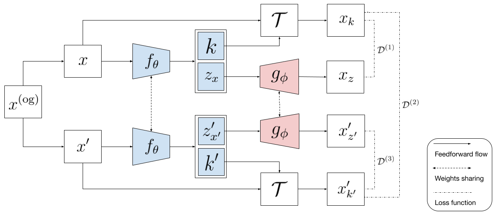

# Harmony

Harmony, A Generic Unsupervised Approach for Disentangling Semantic Content From Parameterized Transformations, is a generic unsupervised framework that simultaneously and explicitly disentangles semantic content from multiple parameterized transformations. In Harmony, we used the power of cross-contrastive learning to explicitly disentangle transformations and semantic content. As an application of Harmony, we disentangle semantic content from multiple geometric and lighting condition transformations in various imaging datasets. With Harmony, we resolved transformation-invariant conformations of proteins from 2D single-particle cryo-EM images. We disentangled transformation parameters from 3D images and applied them to model structural heterogeneity of extremely noisy real and simulated 3D cryo-ET subtomograms. 

